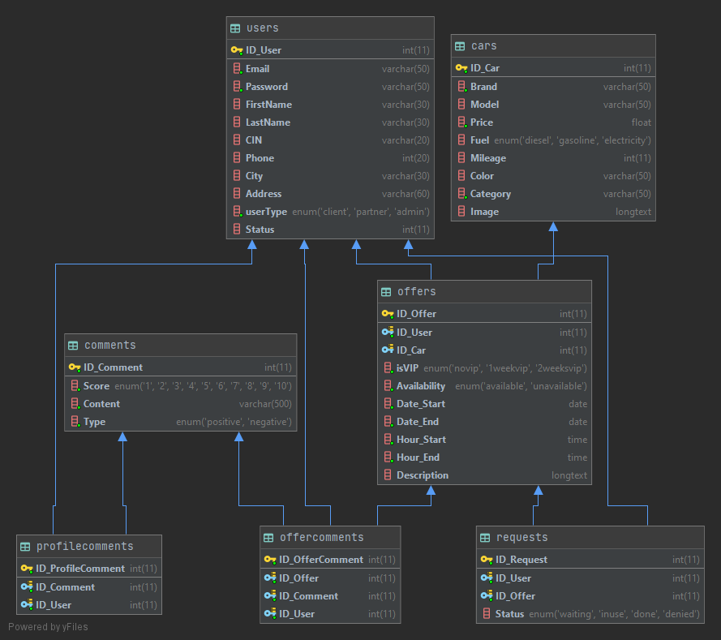

# Nier: AutoRental

Hey there, this is an Academic Project, made by the Engineering students of Computer Science of **ENSATe**.

This Project is about creating a **website**, designed to provide **car rental service**.

The languages and tools that are used so far are: `PHP`, `HTML`, `JS`, `CSS`, `Bootstrap`, `Balsamiq`, `MySQL` `...`

At the moment, the project is at its starting phase. But so far, this is what we've accomplished.

#### Definitions:
_ `Offer` : The published announcement of a car for rental. 
there are 3 type of users to this website:
 _ `Partners`: The users who can put the offers, and the cars for rental.
 _ `Clients`: The users who can take those offers, and the cars for a period of time and pay.
 _ `Admins`: A special user who has the complete authority, he manages and supervises and maintains the functionality of the website.

### Database Diagram:

### Some Mockup pages: 
 

##### Main Page:

 

##### Partner Space:

 

##### Adding an Offer: 

 

##### Offer Info: 

 

##### Offer Registration (Client side): 

